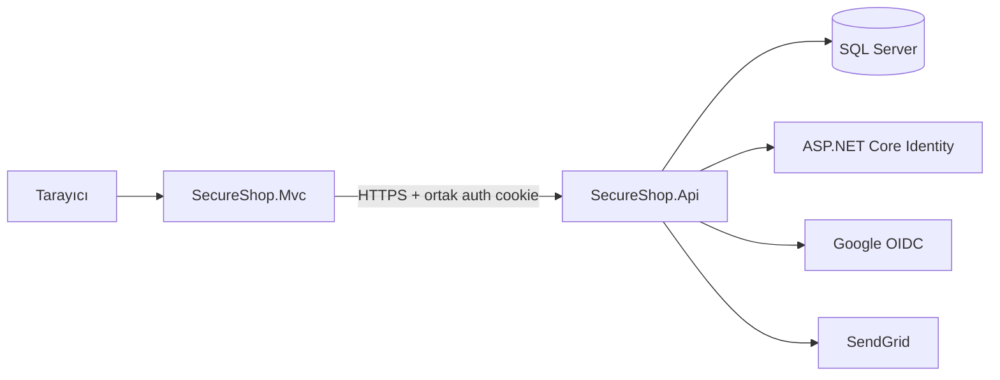

<div align="center">

# SecureShop

### Güvenliği merkeze alan, rol tabanlı modern e-ticaret uygulaması

ASP.NET Core MVC arayüzü, REST API, SQL Server ve ASP.NET Core Identity ile
uçtan uca alışveriş ve sipariş yönetimi.

[](https://github.com/mustafa-oezdemir/SecureShop/actions/workflows/cd.yml)
[](https://dotnet.microsoft.com/)
[](https://github.com/mustafa-oezdemir/SecureShop/releases)
[](SECURITY.md)

[Özellikler](#-özellikler) ·
[Mimari](#-mimari) ·
[Kurulum](#-yerel-kurulum) ·
[Testler](#-testler) ·
[Release](#-cicd-ve-release)

</div>

---

## Genel bakış

SecureShop; müşteri alışveriş akışını, çalışan sipariş operasyonlarını ve
yönetici katalog yönetimini birbirinden ayrılmış yetkilerle sunan örnek bir
e-ticaret sistemidir. MVC uygulaması kullanıcı deneyimini sağlar; iş kuralları,
kimlik doğrulama ve veri erişimi API katmanında tutulur.

### Rol bazlı deneyim

| Rol | Yetkinlikler |
| --- | --- |
| **Müşteri** | Ürün kataloğu, sepet, checkout, sipariş geçmişi ve QR sipariş doğrulama |
| **Çalışan** | Sipariş görüntüleme, durum yönetimi, QR ile teslimat doğrulama ve 2FA |
| **Yönetici** | Ürün/stok/görsel yönetimi, çalışan işlemleri ve denetim kayıtları |

## ✨ Özellikler

- Ürün kataloğu, stok takibi ve sıralı ürün görselleri
- Sunucu tarafında güvenilir fiyat ve sipariş toplamı hesaplama
- Kullanıcıya özel sepet ve sipariş yönetimi
- Süreli, imzalı QR kod ile sipariş doğrulama
- Yerel hesap ve Google OpenID Connect oturumu
- Authenticator tabanlı iki faktörlü kimlik doğrulama
- Admin, çalışan ve müşteri politikalarıyla yetkilendirme
- Yönetici denetim kayıtları
- Optimistic concurrency kontrollü sipariş işlemleri
- Responsive ASP.NET Core MVC arayüzü
- Unit, integration ve MVC test paketleri

## 🛡️ Güvenlik

Proje güvenlik özelliklerini uygulama mimarisinin bir parçası olarak ele alır:

- `HttpOnly`, `Secure` ve `SameSite=Lax` ortak kimlik doğrulama cookie'si
- API ve MVC arasında paylaşılan Data Protection key-ring
- HSTS, HTTPS yönlendirme ve güvenlik response header'ları
- Content Security Policy ve frame koruması
- Identity parola, lockout ve token politikaları
- Login endpoint'i için rate limiting
- Rol ve policy tabanlı endpoint koruması
- Hassas değerler için `.env` / environment variable desteği

Güvenlik açığı bildirmek için [güvenlik politikasını](SECURITY.md) inceleyin.

## 🧱 Mimari



```text
SecureShop/
├── src/
│   ├── SecureShop.Api/             # REST API, iş kuralları, Identity ve EF Core
│   └── SecureShop.Mvc/             # Razor Views, controller'lar ve API istemcileri
├── tests/
│   ├── SecureShop.Api.UnitTests/
│   ├── SecureShop.Api.IntegrationTests/
│   └── SecureShop.Mvc.Tests/
└── .github/workflows/              # CI ve tag tabanlı release otomasyonu
```

## ⚙️ Teknoloji

| Katman | Teknoloji |
| --- | --- |
| Backend | .NET 10, ASP.NET Core Web API |
| UI | ASP.NET Core MVC, Razor, Bootstrap |
| Veri | Entity Framework Core 10, SQL Server |
| Kimlik | ASP.NET Core Identity, Google OpenID Connect, TOTP |
| E-posta | SendGrid |
| Test | xUnit, WebApplicationFactory, EF Core InMemory, Coverlet |
| Otomasyon | GitHub Actions, GitHub Releases |

## 🚀 Yerel kurulum

### Gereksinimler

- [.NET 10 SDK](https://dotnet.microsoft.com/download)
- SQL Server veya Windows üzerinde SQL Server LocalDB
- EF Core CLI: `dotnet tool install --global dotnet-ef`

### 1. Repoyu klonlayın

```bash
git clone https://github.com/mustafa-oezdemir/SecureShop.git
cd SecureShop
```

### 2. Yerel yapılandırmayı oluşturun

PowerShell:

```powershell
Copy-Item .env.example .env
```

Bash:

```bash
cp .env.example .env
```

`.env` içindeki Google istemci bilgilerini ve kullanmak istediğiniz development
kullanıcılarını güncelleyin. Bu dosya Git tarafından takip edilmez.

Temel yapılandırmalar:

| Anahtar | Amaç |
| --- | --- |
| `ConnectionStrings__DefaultConnection` | SQL Server bağlantısı; varsayılan LocalDB ayarı `appsettings.json` içindedir |
| `Authentication__Google__ClientId` | Google OpenID Connect istemci kimliği |
| `Authentication__Google__ClientSecret` | Google OpenID Connect istemci sırrı |
| `SeedUsers__*` | Development admin, çalışan ve müşteri hesapları |
| `QrCodes__Orders__VerificationBaseUrl` | Telefonla QR taraması için erişilebilir HTTPS adresi |
| `Email__SendGridApiKey` | E-posta gönderimi için SendGrid API anahtarı |
| `Email__SenderEmail` | Gönderici e-posta adresi |

> Telefonla QR taraması için `localhost` yerine HTTPS destekli bir tunnel adresi
> kullanın.

### 3. Veritabanını hazırlayın

```bash
dotnet restore
dotnet ef database update --project src/SecureShop.Api
```

### 4. Uygulamaları çalıştırın

İki ayrı terminal açın:

```bash
dotnet run --project src/SecureShop.Api --launch-profile https
```

```bash
dotnet run --project src/SecureShop.Mvc --launch-profile https
```

| Uygulama | HTTPS adresi |
| --- | --- |
| MVC | `https://localhost:7002` |
| API | `https://localhost:7001` |

## 🧪 Testler

Tüm testleri çalıştırmak için:

```bash
dotnet test SecureShop.sln
```

CI, test projelerini birbirinden ayrılmış sonuç klasörlerinde çalıştırır ve TRX
ile Cobertura coverage çıktılarını artifact olarak saklar.

```bash
dotnet test tests/SecureShop.Api.UnitTests
dotnet test tests/SecureShop.Api.IntegrationTests
dotnet test tests/SecureShop.Mvc.Tests
```

## 📦 CI/CD ve release

GitHub Actions akışı:

1. Bağımlılıkları restore eder.
2. Çözümü `Release` modunda derler.
3. Unit, integration ve MVC testlerini çalıştırır.
4. API ve MVC publish paketlerini artifact olarak üretir.
5. `v*` tag'lerinde otomatik GitHub Release oluşturur.

Yeni sürüm yayınlamak için:

```bash
git tag -a v1.0.1 -m "SecureShop v1.0.1"
git push origin v1.0.1
```

Harici dağıtım servisi, repository secret veya ücretli bulut kaynağı gerekmez.

## Katkı

Katkılarınızı küçük ve odaklı commit'lerle hazırlayın; pull request açmadan önce
çözümü derleyip testleri çalıştırın.

---

<div align="center">

ASP.NET Core ile güvenli web uygulaması pratiklerini göstermek için geliştirildi.

</div>
