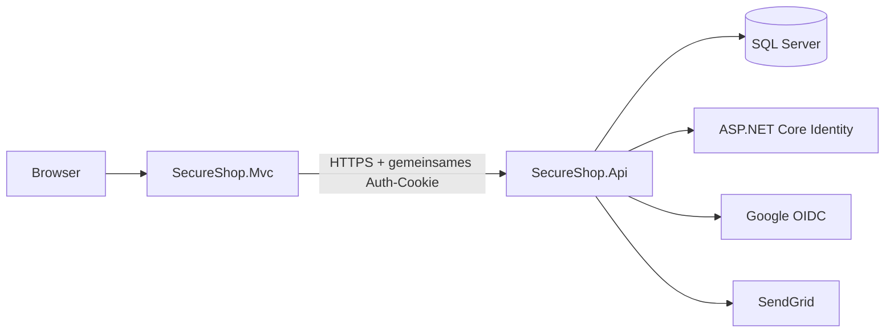

<div align="center">

# SecureShop

### Eine moderne, rollenbasierte E-Commerce-Anwendung mit Security by Design

Durchgängige Einkaufs- und Bestellprozesse mit ASP.NET Core MVC, REST API,
SQL Server und ASP.NET Core Identity.

[](https://github.com/mustafa-oezdemir/SecureShop/actions/workflows/cd.yml)
[](https://dotnet.microsoft.com/)
[](https://github.com/mustafa-oezdemir/SecureShop/releases)
[](SECURITY.md)

[Funktionen](#-funktionen) ·
[Architektur](#-architektur) ·
[Installation](#-lokale-installation) ·
[Tests](#-tests) ·
[Release](#-cicd-und-releases)

</div>

---

## Überblick

SecureShop ist ein beispielhaftes E-Commerce-System mit klar getrennten
Berechtigungen für Kunden, Mitarbeiter und Administratoren. Die MVC-Anwendung
stellt die Benutzeroberfläche bereit; Geschäftsregeln, Authentifizierung und
Datenzugriff liegen in der API.

### Rollenbasierte Benutzererfahrung

| Rolle | Berechtigungen |
| --- | --- |
| **Kunde** | Produktkatalog, Warenkorb, Checkout, Bestellhistorie und QR-Bestellprüfung |
| **Mitarbeiter** | Bestellübersicht, Statusverwaltung, QR-Übergabeprüfung und 2FA |
| **Administrator** | Produkt-, Bestands- und Bildverwaltung sowie Audit-Protokolle |

## ✨ Funktionen

- Produktkatalog, Bestandsführung und sortierbare Produktbilder
- Vertrauenswürdige Preis- und Summenberechnung auf dem Server
- Benutzerbezogene Warenkörbe und Bestellungen
- Zeitlich begrenzte, signierte QR-Codes zur Bestellprüfung
- Lokale Anmeldung und Google OpenID Connect
- Zwei-Faktor-Authentifizierung über Authenticator-Apps
- Rollen- und richtlinienbasierte Autorisierung
- Audit-Protokolle für administrative Vorgänge
- Optimistic Concurrency bei Bestellvorgängen
- Responsive Benutzeroberfläche mit ASP.NET Core MVC
- Unit-, Integrations- und MVC-Tests

## 🛡️ Sicherheit

Sicherheitsmaßnahmen sind ein fester Bestandteil der Architektur:

- Gemeinsames Authentifizierungs-Cookie mit `HttpOnly`, `Secure` und
  `SameSite=Lax`
- Gemeinsamer Data-Protection-Key-Ring für API und MVC
- HSTS, HTTPS-Weiterleitung und Security Response Headers
- Content Security Policy und Schutz vor Framing
- Identity-Richtlinien für Passwörter, Sperrungen und Tokens
- Rate Limiting für den Login-Endpunkt
- Rollen- und Policy-Schutz für Endpunkte
- `.env`- und Environment-Variable-Unterstützung für sensible Werte

Hinweise zum Melden von Schwachstellen stehen in der
[Security Policy](SECURITY.md).

## 🧱 Architektur



```text
SecureShop/
├── src/
│   ├── SecureShop.Api/             # REST API, Geschäftslogik, Identity und EF Core
│   └── SecureShop.Mvc/             # Razor Views, Controller und API-Clients
├── tests/
│   ├── SecureShop.Api.UnitTests/
│   ├── SecureShop.Api.IntegrationTests/
│   └── SecureShop.Mvc.Tests/
└── .github/workflows/              # CI und tagbasierte Release-Automatisierung
```

## ⚙️ Technologie

| Bereich | Technologie |
| --- | --- |
| Backend | .NET 10, ASP.NET Core Web API |
| UI | ASP.NET Core MVC, Razor, Bootstrap |
| Daten | Entity Framework Core 10, SQL Server |
| Identity | ASP.NET Core Identity, Google OpenID Connect, TOTP |
| E-Mail | SendGrid |
| Tests | xUnit, WebApplicationFactory, EF Core InMemory, Coverlet |
| Automatisierung | GitHub Actions, GitHub Releases |

## 🚀 Lokale Installation

### Voraussetzungen

- [.NET 10 SDK](https://dotnet.microsoft.com/download)
- SQL Server oder SQL Server LocalDB unter Windows
- EF Core CLI: `dotnet tool install --global dotnet-ef`

### 1. Repository klonen

```bash
git clone https://github.com/mustafa-oezdemir/SecureShop.git
cd SecureShop
```

### 2. Lokale Konfiguration anlegen

PowerShell:

```powershell
Copy-Item .env.example .env
```

Bash:

```bash
cp .env.example .env
```

Anschließend die Google-Zugangsdaten und die gewünschten
Development-Benutzer in `.env` eintragen. Die Datei wird von Git ignoriert.

Wichtige Konfigurationsschlüssel:

| Schlüssel | Zweck |
| --- | --- |
| `ConnectionStrings__DefaultConnection` | SQL-Server-Verbindung; eine LocalDB-Vorgabe steht in `appsettings.json` |
| `Authentication__Google__ClientId` | Client-ID für Google OpenID Connect |
| `Authentication__Google__ClientSecret` | Client-Secret für Google OpenID Connect |
| `SeedUsers__*` | Development-Konten für Administrator, Mitarbeiter und Kunde |
| `QrCodes__Orders__VerificationBaseUrl` | Öffentlich erreichbare HTTPS-Adresse für QR-Scans |
| `Email__SendGridApiKey` | SendGrid API Key für den E-Mail-Versand |
| `Email__SenderEmail` | Absenderadresse für E-Mails |

> Für QR-Scans mit einem Smartphone muss anstelle von `localhost` eine über
> HTTPS erreichbare Tunnel-Adresse verwendet werden.

### 3. Datenbank vorbereiten

```bash
dotnet restore
dotnet ef database update --project src/SecureShop.Api
```

### 4. Anwendungen starten

Die folgenden Befehle in zwei separaten Terminals ausführen:

```bash
dotnet run --project src/SecureShop.Api --launch-profile https
```

```bash
dotnet run --project src/SecureShop.Mvc --launch-profile https
```

| Anwendung | HTTPS-Adresse |
| --- | --- |
| MVC | `https://localhost:7002` |
| API | `https://localhost:7001` |

## 🧪 Tests

Alle Tests ausführen:

```bash
dotnet test SecureShop.sln
```

In der CI werden die Testprojekte mit getrennten Ergebnisverzeichnissen
ausgeführt. TRX- und Cobertura-Dateien werden als Artifacts gespeichert.

```bash
dotnet test tests/SecureShop.Api.UnitTests
dotnet test tests/SecureShop.Api.IntegrationTests
dotnet test tests/SecureShop.Mvc.Tests
```

## 📦 CI/CD und Releases

Der GitHub-Actions-Workflow:

1. stellt die Abhängigkeiten wieder her,
2. baut die Solution in der `Release`-Konfiguration,
3. führt Unit-, Integrations- und MVC-Tests aus,
4. erzeugt veröffentlichungsfertige API- und MVC-Artifacts,
5. erstellt bei `v*`-Tags automatisch ein GitHub Release.

Weitere Informationen zu Triggern und Aufbewahrungszeiten stehen in der
[GitHub-Actions-Dokumentation](.github/WORKFLOWS.md).

Eine neue Version veröffentlichen:

```bash
git tag -a v1.0.1 -m "SecureShop v1.0.1"
git push origin v1.0.1
```

Es sind kein externer Deployment-Dienst, keine Repository Secrets und keine
kostenpflichtigen Cloud-Ressourcen erforderlich.

## Mitwirken

Beiträge sollten in kleinen, fokussierten Commits vorbereitet werden. Vor einem
Pull Request bitte die Solution bauen und alle Tests ausführen.

---

<div align="center">

Entwickelt als Referenz für sichere Webanwendungen mit ASP.NET Core.

</div>
